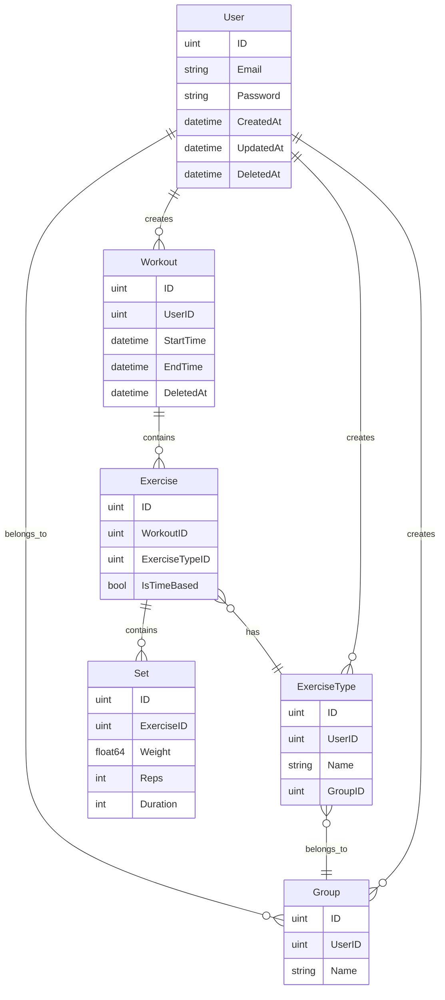

# Data Models Documentation

### Entity Relationship Diagram

### Model Descriptions

#### User
The central entity that owns all other entities in the system.
- Has many Workouts
- Has many ExerciseTypes
- Has many Groups
- Contains authentication information (email, password)
- Includes standard GORM timestamps (CreatedAt, UpdatedAt, DeletedAt)

#### Workout
Represents a workout session.
- Belongs to a User
- Has many Exercises
- Tracks start and end times
- Supports soft delete
- Response types:
  - `WorkoutResponse`: Basic workout info
  - `FullWorkoutResponse`: Includes exercises and their sets

#### Exercise
Represents a specific exercise within a workout.
- Belongs to a Workout
- Belongs to an ExerciseType
- Has many Sets
- Can be either time-based or weight-based
- Response type includes exercise type name and appropriate sets

#### ExerciseType
Represents a type of exercise that can be performed.
- Belongs to a User
- Optionally belongs to a Group
- Has many Exercises
- Contains the name of the exercise
- Response type includes group information

#### Set
Represents a single set of an exercise.
- Belongs to an Exercise
- Can be either:
  - Weight-based (weight and reps)
  - Duration-based (duration only)
- Response types:
  - `SetWeightResponse`: For weight-based sets
  - `SetDurationResponse`: For duration-based sets

#### Group
Represents a group of exercise types.
- Belongs to a User
- Has many ExerciseTypes
- Name is unique per user
- Simple response type with ID and name

### Key Features

1. **Soft Delete Support**
   - Workouts support soft delete through GORM's DeletedAt field
   - Allows for workout recovery and history tracking

2. **Flexible Exercise Types**
   - Exercise types can be organized into groups
   - Supports both time-based and weight-based exercises

3. **Comprehensive Response Types**
   - Each model has corresponding response types for API responses
   - Response types include only necessary information
   - Support for nested relationships (e.g., workout with exercises and sets)

4. **User-Specific Data**
   - All data is scoped to specific users
   - Groups have unique names per user
   - Exercise types are user-specific

5. **Time Tracking**
   - Workouts track start and end times
   - Supports both completed and in-progress workouts

### Database Relationships

1. **One-to-Many Relationships**
   - User → Workouts
   - User → ExerciseTypes
   - User → Groups
   - Workout → Exercises
   - Exercise → Sets
   - Group → ExerciseTypes

2. **Many-to-One Relationships**
   - Workout → User
   - Exercise → Workout
   - Exercise → ExerciseType
   - Set → Exercise
   - ExerciseType → Group
   - ExerciseType → User
   - Group → User

3. **Optional Relationships**
   - ExerciseType → Group (nullable)
   - Set → Weight/Reps (for time-based exercises)
   - Set → Duration (for weight-based exercises)
   - Workout → EndTime (for in-progress workouts) 